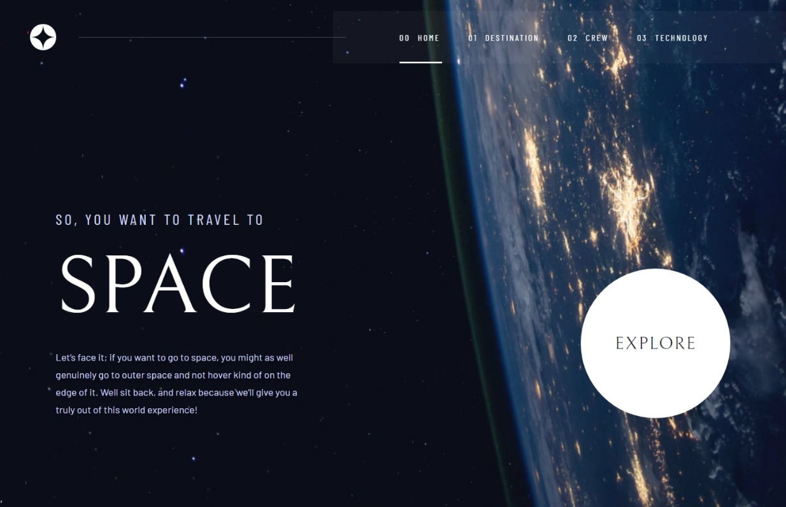
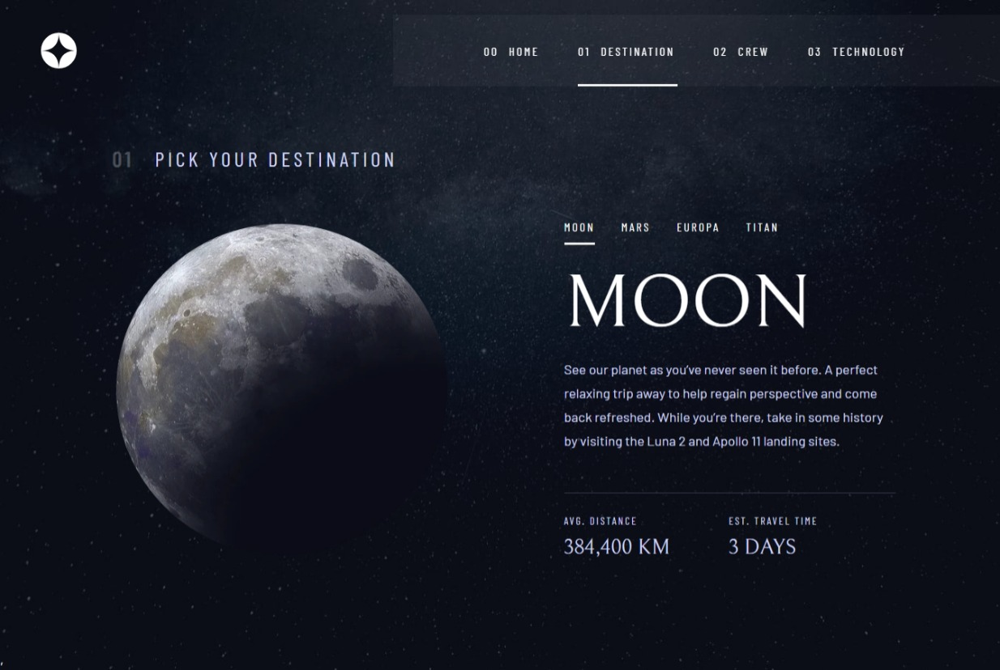
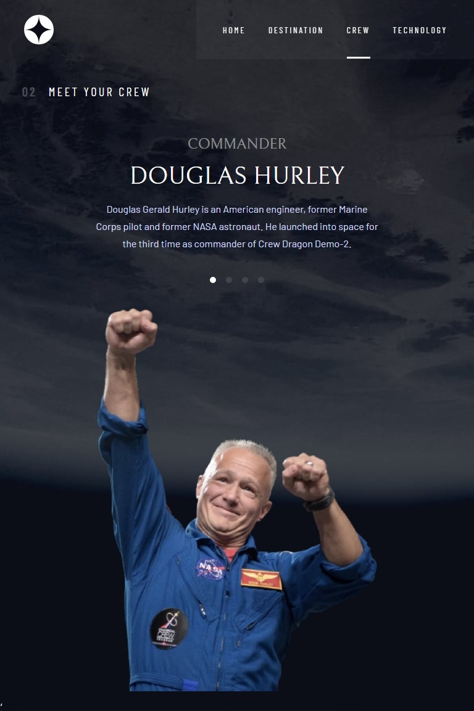
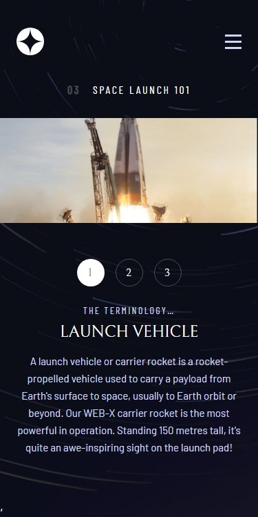

## Table of contents

- [Overview](#overview)
  - [The challenge](#the-challenge)
  - [Screenshot](#screenshot)
  - [Links](#links)
- [My process](#my-process)
  - [Built with](#built-with)
  - [What I learned](#what-i-learned)
  - [Continued development](#continued-development)
- [Author](#author)

## Overview

### The challenge

Users should be able to:

- View the optimal layout for each of the website's pages depending on their device's screen size (1440px - 1360px - 768px - 375px).
- See hover states for all interactive elements on the page
- View each page and be able to toggle between the tabs to see new information

### Screenshot

 this screenshot shows the view of the Home page on screen size 1440px.
 this screenshot shows the view of the Destination page on screen size 1360px.

this screenshot shows the view of the Crew page on screen size 768px.

this screenshot shows the view of the Technology page on screen size 375px.

### Links

- Solution URL: (https://www.frontendmentor.io/solutions/space-tourism-website-Pm7zurPgbE)
- Live Site URL: (https://space-tourism-phi-taupe.vercel.app/home)

## My process

### Built with

- Semantic HTML5 markup
- CSS custom properties
- Flexbox
- CSS Grid
- Bootstrap
- Mobile-first workflow
- [React](https://reactjs.org/) - JS library v18.2.0

### What I learned

I exploited this project to learn React architecture and I developed this project using the function components method. Also, I used some hooks like useState and useEffect in addition to some methods  from the react-router-dom library such as  Routes, Route, Navigate and useLocation method.

### Continued development

I will learn more about React hooks and I'm looking forward to building the next project which should be able to handle APIs requests using the React library.

## Author

- LinkedIn - [@eslam-bakr](https://www.linkedin.com/in/eslam-bakr)
- Frontend Mentor - [@eslambakr37](https://www.frontendmentor.io/profile/eslambakr37)
- Twitter - [@EslamBakr37](https://www.twitter.com/EslamBakr37)

